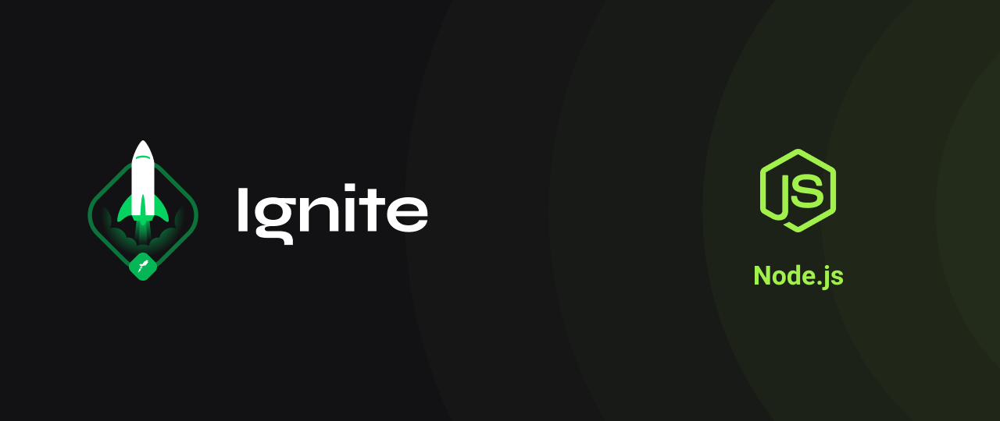

# 

## Sobre o projeto

Explorando os Fundamentos do Node.js para criar uma API REST completa, sem a necessidade de bibliotecas adicionais. Este projeto inclui operações CRUD (Create, Read, Update, Delete) e utiliza conceitos avançados, como o uso de streams, parâmetros de consulta (query parameters), parâmetros de rota (route parameters), manipulação de solicitações do corpo (body request), construção dinâmica de caminhos de rota (build route path) e implementação de middlewares para uma experiência de desenvolvimento robusta e eficaz

## Tecnologias

- [Serverless](https://www.serverless.com/)

## Instalação

```sh
yarn
```

## Comandos

```bash
# Criar projeto
$ yarn dev

```

## Contribuição

Contribuições são bem-vindas! Para contribuir, basta abrir uma issue ou pull request neste repositório.

## Autor

Feito por Mauricio Aires 👋🏽
